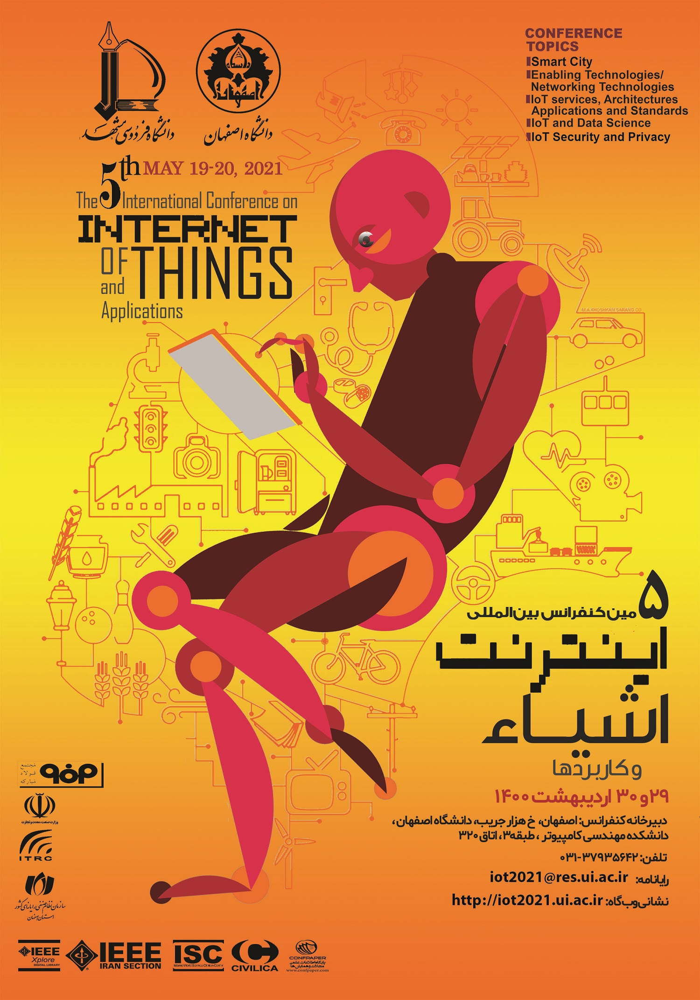

The presentation was prepared for **The 5th International Conference on Internet of Things and Its Application** at Isfahan University, May 19-20, 2021. You can see more details about conference [here](https://iot2021.ui.ac.ir).

[Visit Keynotes here](https://alirezasn.github.io/files/talks/talk_12_slides.pdf)

    

