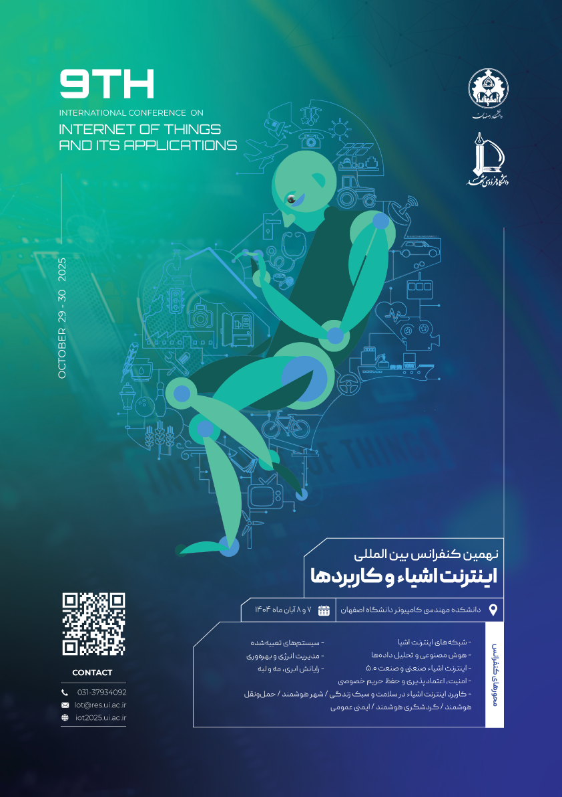

The presentation was prepared for **The 9th International Conference on Internet of Things and Its Application** at Isfahan University, May 29-30, 2025. You can see more details about conference [here](https://iot2025.ui.ac.ir/).

[Visit Keynotes here](https://alirezasn.ir/files/talks/talk_20_slides.pdf)

    

